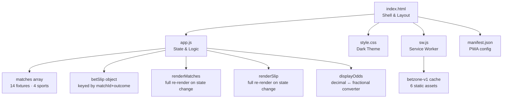
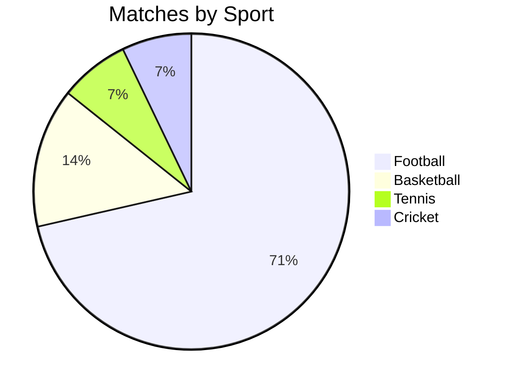
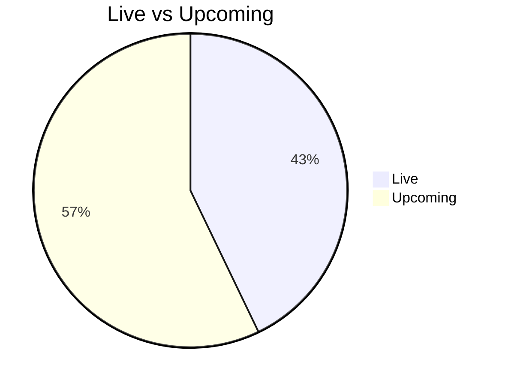

# BetZone


> A modern, dark-themed sports betting PWA — no framework, no build step, runs entirely in the browser.

**Live demo:** [https://ivanong.github.io/sports-betting/](https://ivanong.github.io/sports-betting/)

---

## Screenshots


---

## Features

| Feature | Detail |
|---|---|
| Live match ticker | Scrolling bar showing in-progress scores |
| Multi-sport coverage | Football, Basketball, Tennis, Cricket |
| Odds formats | Toggle between Decimal and Fractional on the fly |
| Bet slip | Add/remove selections, set stake, see potential payout |
| Balance tracking | Starts at $1,000 — deducted on each confirmed bet |
| Offline support | Service worker caches all assets for offline use |
| PWA installable | Add to home screen on desktop and mobile |

---

## Sports & Leagues

```
Football       Basketball    Tennis        Cricket
─────────────  ────────────  ────────────  ─────────────────
Premier League NBA           ATP Tour      IPL
Champions Lg.
La Liga
Bundesliga
Serie A
```

---

## Architecture



---

## Data at a Glance





---

## Running Locally

```
sports-betting/start-server.bat
```

Then open [http://localhost:3000](http://localhost:3000).

---

## Project Structure

```
sports-betting/
├── index.html          Shell layout — header, ticker, 3-column grid
├── style.css           Dark theme (#0f1923 bg, #00e676 accent), CSS vars
├── app.js              All state & logic (matches, bet slip, odds)
├── sw.js               Service worker — offline cache (betzone-v1)
├── manifest.json       PWA manifest — SVG icon, start_url
└── start-server.bat    One-click PowerShell HTTP server
```
